# Arquitectura do Sistema — boss.ai

**Fase:** Brownfield Discovery — Phase 1 (Architect)
**Autor:** @architect (Aria)
**Data:** 2026-05-23
**Escopo:** Análise factual do estado actual de `C:\Users\mario\dev\boss.ai`

---

## Índice

1. [Sumário executivo](#1-sumário-executivo)
2. [Camadas e componentes](#2-camadas-e-componentes)
3. [Diagrama de componentes](#3-diagrama-de-componentes)
4. [Pontos de integração](#4-pontos-de-integração)
5. [Riscos arquitecturais](#5-riscos-arquitecturais)
6. [Conclusão](#6-conclusão)

---

## 1. Sumário executivo

O **boss.ai** é o monorepo pessoal de Mário Carvalho que aloja, num único `git` privado (`UNIFY-MC/boss.ai` em `main`, inicializado a 2026-05-23), dois subsistemas com naturezas e responsabilidades muito distintas. O primeiro é o **framework AIOX** (Synkra AIOX v5.2.9), instalado in-tree em `.aiox-core/` a partir de `@aiox-squads/core` — um motor de orquestração multi-agente que define 12 agentes (`@dev`, `@qa`, `@architect`, `@pm`, `@po`, `@sm`, `@analyst`, `@devops`, `@data-engineer`, `@ux-design-expert`, `@squad-creator`, `@aiox-master`), 213 tasks, 15 workflows, 8 templates e 5 checklists. Este framework é projectado para conduzir o ciclo de Story-Driven Development (SDC), com gates constitucionais inegociáveis (CLI First, Agent Authority, No Invention, etc.) e tem uma constituição formal em `.aiox-core/constitution.md`.

O segundo subsistema é o **acervo-formacoes/**, um site estático puro (HTML + Tailwind CDN + Google Fonts, sem build step nem framework JS) com 10 páginas HTML que arquivam 4 formações já assistidas, servido em Vercel (`projectId prj_ppgdEvK63ZJmm2kMujFULGhiVou8`, `team_nnquMJdqLLLdcCjOdJhQov41`) com cabeçalhos de segurança recém-endurecidos (CSP, HSTS, X-Frame-Options, Permissions-Policy). Não tem backend, base de dados, nem fonte de dados externa em runtime.

Acoplando os dois mundos, há um **plano de configurações por IDE** sincronizado por `aiox ideSync`: sete directorias (`.claude/`, `.codex/`, `.gemini/`, `.cursor/`, `.kimi/`, `.antigravity/`, e parcialmente `.github/`) cada uma com a sua representação dos mesmos 12 agentes, derivadas de `.aiox-core/development/agents/` como single source of truth. Não há, neste momento, código aplicacional (TypeScript/Node), nem testes automatizados, nem migrations, nem base de dados — apenas configuração, prompts, hooks de governança e o site estático.

---

## 2. Camadas e componentes

### 2.1 Framework AIOX (`.aiox-core/`)

| Atributo | Valor |
|----------|-------|
| Pacote NPM | `@aiox-squads/core-internal` v5.2.9 |
| Engine | Node ≥18, npm ≥9 |
| Repo upstream | `git+https://github.com/SynkraAI/aiox-core.git` (directory `.aiox-core`) |
| Instalado em | `2025-01-14` (per `core-config.yaml`) |
| Último upgrade | `2026-05-22T22:46:23Z` |
| Modo de instalação | In-tree, **commitado** ao repo `boss.ai` (não é `node_modules` standard) |

**Módulos principais** (`.aiox-core/`):

- **`core/`** — biblioteca interna do framework. 27 sub-módulos, incluindo:
  - `code-intel/` — provider opcional de análise de código (graceful fallback se indisponível)
  - `synapse/` — context engine activado em `UserPromptSubmit` (ver §2.3)
  - `orchestration/`, `quality-gates/`, `permissions/`, `session/`, `manifest/`, `memory/`, `registry/`, `ids/` (Incremental Development System), `graph-dashboard/`, `mcp/`, `pro/`, `migration/`, `resilience/`, etc.
  - **L1 — protected** por deny rules em `.claude/settings.json` (`Edit/Write` bloqueados)
- **`cli/`** — entrypoints CLI (`config`, `generate`, `manifest`, `mcp`, `metrics`, `migrate`, `pro`, `qa`, `validate`, `workers`)
- **`development/`** — L2 templates do framework:
  - `agents/` — 12 personas (.md + sub-pasta por agente) — **single source of truth do ideSync**
  - `tasks/` — 213 tarefas executáveis
  - `workflows/` — 15 workflows (incluindo brownfield-discovery)
  - `templates/` — 8 templates (PRD, stories, architecture, etc.)
  - `checklists/` — 5 checklists de validação
  - `agent-teams/`, `data/`, `external-executors/`, `scripts/` (.aiox-core/development/scripts)
- **`infrastructure/`** — scripts L2 protegidos (ex.: `llm-routing/templates/claude-free-tracked.cmd`)
- **`data/`** — L3 mutável (project-specific config data)
- **`elicitation/`**, **`manifests/schema/`**, **`presets/`**, **`product/`**, **`scripts/`**, **`schemas/`**, **`workflow-intelligence/`**, **`monitor/`**, **`docs/`**, **`node_modules/`** (in-tree devido ao modelo de instalação)
- **Constituição** em `.aiox-core/constitution.md` (6 artigos: I-CLI First, II-Agent Authority, III-Story-Driven, IV-No Invention, V-Quality First, VI-Absolute Imports)
- **`core-config.yaml`** (10 KB) — configuração viva do projecto (paths, IDE sync, modelos LLM, MCP, CodeRabbit, autoClaude, boundary protection)

**Boundary toggle:** `boundary.frameworkProtection: true` em `core-config.yaml` activa as deny rules.

### 2.2 Configurações por IDE (sincronizadas)

Single source of truth: `.aiox-core/development/agents/`.
Sync engine: `aiox ideSync` (config em `core-config.yaml` § `ideSync`).

| IDE | Path | Formato | Conteúdo |
|-----|------|---------|----------|
| Claude Code | `.claude/commands/AIOX/agents/` + `.claude/skills/` + `.claude/rules/` + `.claude/hooks/` | `full-markdown-yaml` | 12 agents .md, 8 skills, 11 rules, 2 hooks .cjs, CLAUDE.md, settings.json |
| Codex | `.codex/agents/` + `.codex/skills/` | `full-markdown-yaml` | 12 agents .md, 12 skills (`aiox-{agent}`) |
| Gemini | `.gemini/commands/` + `.gemini/rules/AIOX/` | `full-markdown-yaml` | 12 `.toml` commands + 1 `aiox-menu.toml` + AIOX rules |
| Cursor | `.cursor/rules/agents/` | `condensed-rules` | regras compactadas |
| Antigravity | `.antigravity/rules/agents/` | `cursor-style` | regras compactadas |
| Kimi | `.kimi/skills/` | `kimi-skill` | 12 skills (`aiox-{agent}`) — fallback de `.codex/agents/` |
| GitHub Copilot | `.github/agents/` | `github-copilot` | **flag enabled mas directoria não criada no FS actual** |
| VSCode | (flag `vscode: true` mas sem subpath específico observado) | — | Sem artefactos no FS, apenas flag |

`ideSync.validation.strictMode: true` e `failOnDrift: true` indicam intenção de detectar drift, mas **nenhum CI step ou hook activo executa `aiox ideSync --check`** (ver §5).

### 2.3 Hooks (`.claude/hooks/`)

Registo dos hooks vive em `.claude/settings.local.json` (gitignorado). Existem dois hooks `.cjs` activos:

| Hook | Trigger | Comportamento | Linhas |
|------|---------|---------------|--------|
| `synapse-engine.cjs` | `UserPromptSubmit` | Activa SYNAPSE context engine (`.aiox-core/core/synapse/`) — injecção contextual de rules/manifests | 113 |
| `enforce-git-push-authority.cjs` | `PreToolUse` (matcher `Bash`) | Bloqueia (`permissionDecision: deny`) `git push`, `gh pr create`, `gh pr merge` quando `AIOX_ACTIVE_AGENT != devops` (alias `github-devops`, `aiox-devops`) | 143 |

O `README.md` em `.claude/hooks/` documenta mais 5 hooks Python (`read-protection.py`, `enforce-architecture-first.py`, `write-path-validation.py`, `sql-governance.py`, `slug-validation.py`, `mind-clone-governance.py`) e 2 hooks `.cjs` adicionais (`code-intel-pretool.cjs`, `precompact-session-digest.cjs`) — **nenhum destes ficheiros existe no FS actual deste repo**, apenas a documentação. Confirma-se que a doc do README é um snapshot do projecto-modelo, não do estado real (ver §5).

### 2.4 Site Vercel (`acervo-formacoes/`)

| Atributo | Valor |
|----------|-------|
| Stack | HTML5 + Tailwind via CDN + Google Fonts (Inter, Lora, Playfair Display) |
| Build step | **Nenhum** — deploy directo de ficheiros estáticos |
| Páginas HTML | 10 (excluindo `materiais/` gitignorado) |
| Formações arquivadas | 4 (`aiox-cohort-fundamentals`, `aulao-claude-code`, `claude-code-build-day`, `reprise-masterclass-design-ia`) |
| Shared assets | `_shared/sidebar.css`, `_shared/sidebar.js`, `_shared/page-toc.css` |
| Deploy | Vercel — `projectId: prj_ppgdEvK63ZJmm2kMujFULGhiVou8`, `orgId: team_nnquMJdqLLLdcCjOdJhQov41`, `projectName: acervo-formacoes` |
| `vercel.json` | `cleanUrls: true`, `trailingSlash: true`, headers de segurança aplicados a `/(.*)` |
| Headers de segurança | `X-Robots-Tag: noindex,nofollow`, `Referrer-Policy: strict-origin-when-cross-origin`, `X-Frame-Options: SAMEORIGIN`, `X-Content-Type-Options: nosniff`, `HSTS max-age=63072000; includeSubDomains; preload`, `Permissions-Policy` restrita, **CSP** com `script-src 'self' 'unsafe-inline' https://cdn.tailwindcss.com`, `font-src 'self' https://fonts.gstatic.com`, `frame-ancestors 'none'`, `object-src 'none'` |
| `.vercelignore` | Exclui `formacoes/aulao-claude-code/materiais/` e `claude-code-build-day/assets/checklist-seguranca.md` (materiais de cursos privados) |

Nenhum framework SPA, nenhum API endpoint, nenhuma dependência runtime. CSP **permite `unsafe-inline` para `script-src`** porque Tailwind CDN injecta scripts inline para gerar classes utilitárias.

---

## 3. Diagrama de componentes

```mermaid
graph TD
    subgraph "Repo boss.ai (UNIFY-MC/boss.ai @ main)"
        direction TB

        subgraph "L1/L2 Framework AIOX (.aiox-core/) — Protected"
            CORE["core/<br/>27 submódulos<br/>(synapse, code-intel,<br/>orchestration, ids, mcp...)"]
            CLI[".aiox-core/cli/<br/>9 grupos de comandos"]
            CONST["constitution.md<br/>(6 artigos)"]
            DEV_AGENTS["development/agents/<br/>12 agentes ⭐ SSOT"]
            DEV_TASKS["development/tasks/<br/>213 .md"]
            DEV_WF["development/workflows/<br/>15 workflows"]
            DEV_TPL["development/templates/<br/>8 templates"]
            DEV_CHK["development/checklists/<br/>5 checklists"]
            INFRA["infrastructure/<br/>(scripts L2)"]
        end

        subgraph "L3 Project Config"
            CFG["core-config.yaml<br/>(10 KB, viva)"]
            DATA[".aiox-core/data/"]
            MEM[".aiox-core/development/<br/>agents/*/MEMORY.md"]
            AGENTS_MD["AGENTS.md (Codex)"]
        end

        subgraph "IDE Configs (sincronizados via aiox ideSync)"
            CLAUDE[".claude/<br/>commands+skills+rules+<br/>hooks+CLAUDE.md"]
            CODEX[".codex/<br/>agents+skills"]
            GEMINI[".gemini/<br/>commands+rules"]
            CURSOR[".cursor/<br/>rules/agents"]
            KIMI[".kimi/<br/>skills"]
            ANTI[".antigravity/<br/>rules/agents"]
            COPILOT[".github/agents<br/>(flag, missing)"]
        end

        subgraph "Hooks activos (.claude/hooks/)"
            H1["synapse-engine.cjs<br/>UserPromptSubmit"]
            H2["enforce-git-push-authority.cjs<br/>PreToolUse(Bash)"]
        end

        subgraph "Site estático Vercel (acervo-formacoes/)"
            INDEX["index.html (33 KB)"]
            FORM["formacoes/<br/>4 formações × N páginas"]
            SHARED["_shared/<br/>sidebar.css/js, page-toc.css"]
            VCJ["vercel.json<br/>(headers de segurança)"]
            VERC[".vercel/project.json<br/>(team+project IDs)"]
        end

        subgraph "L4 Runtime (gitignored)"
            ENV[".env (SUPABASE_* vazios,<br/>DEEPSEEK/OPENROUTER/...)"]
            LOCAL[".claude/settings.local.json<br/>(allow rules + hooks)"]
            DOCS["docs/brownfield/<br/>(este documento)"]
        end

        subgraph "CI (.github/workflows/)"
            CI["ci.yml<br/>3 jobs: secret-scan,<br/>aiox-validate, html-lint"]
        end
    end

    subgraph "Externos"
        VERCEL["Vercel<br/>(static deploy)"]
        GITHUB["GitHub<br/>UNIFY-MC/boss.ai (private)"]
        GITLEAKS["gitleaks-action<br/>(CI)"]
        TAILWIND["cdn.tailwindcss.com"]
        GFONTS["fonts.googleapis.com<br/>fonts.gstatic.com"]
        CR["CodeRabbit CLI<br/>(WSL, opcional)"]
        DMCP["Docker MCP Toolkit<br/>(opcional, port 8080)"]
        AIOXNPM["@aiox-squads/core<br/>(upstream NPM)"]
    end

    DEV_AGENTS -- "ideSync" --> CLAUDE
    DEV_AGENTS -- "ideSync" --> CODEX
    DEV_AGENTS -- "ideSync" --> GEMINI
    DEV_AGENTS -- "ideSync" --> CURSOR
    DEV_AGENTS -- "ideSync" --> KIMI
    DEV_AGENTS -- "ideSync" --> ANTI
    DEV_AGENTS -. "ideSync (config'd<br/>but no artifacts)" .-> COPILOT

    CLAUDE --> H1
    CLAUDE --> H2
    H1 --> CORE
    CFG -. governs .-> CORE
    CFG -. governs .-> CLI

    FORM --> SHARED
    INDEX --> SHARED
    INDEX -- "fetches" --> TAILWIND
    INDEX -- "fetches" --> GFONTS
    VCJ -- "deploy headers" --> VERCEL
    VERC -- "binds to" --> VERCEL

    GITHUB -- "push triggers" --> CI
    CI --> GITLEAKS
    CI -- "validates" --> CORE
    CI -- "lints" --> FORM
    CI -- "lints" --> INDEX

    AIOXNPM -. "installed in-tree<br/>(commitado)" .-> CORE
    CR -. "optional<br/>(WSL only)" .-> CFG
    DMCP -. "optional<br/>configured" .-> CFG

    classDef protected fill:#fee,stroke:#c33,stroke-width:2px,color:#000;
    classDef mutable fill:#efe,stroke:#393,stroke-width:1px,color:#000;
    classDef sync fill:#eef,stroke:#339,stroke-width:1px,color:#000;
    classDef external fill:#ffd,stroke:#999,stroke-width:1px,color:#000,stroke-dasharray: 5 5;

    class CORE,CLI,CONST,DEV_AGENTS,DEV_TASKS,DEV_WF,DEV_TPL,DEV_CHK,INFRA protected;
    class CFG,DATA,MEM,AGENTS_MD,DOCS,ENV,LOCAL mutable;
    class CLAUDE,CODEX,GEMINI,CURSOR,KIMI,ANTI,COPILOT sync;
    class VERCEL,GITHUB,GITLEAKS,TAILWIND,GFONTS,CR,DMCP,AIOXNPM external;
```

**Legenda:**
- **Vermelho (protected)** — L1/L2 framework, deny rules activas
- **Verde (mutable)** — L3/L4 project config + runtime
- **Azul (sync)** — IDE configs derivados via `aiox ideSync`
- **Amarelo tracejado (external)** — sistemas externos

---

## 4. Pontos de integração

### 4.1 Vercel (deploy do `acervo-formacoes/`)

- **Bind:** `.vercel/project.json` → `projectId prj_ppgdEvK63ZJmm2kMujFULGhiVou8`, `orgId team_nnquMJdqLLLdcCjOdJhQov41`
- **Configuração:** `acervo-formacoes/vercel.json` (cleanUrls, trailingSlash, headers de segurança em `/(.*)`)
- **Ignore:** `.vercelignore` excluindo materiais de cursos privados (terceiros)
- **Trigger:** assumido como auto-deploy ao push (não validado neste documento — `.github/workflows/` não contém step Vercel)
- **Tipo de deploy:** estático puro, sem build step

### 4.2 GitHub (`UNIFY-MC/boss.ai`)

- **Remote:** `https://github.com/UNIFY-MC/boss.ai.git`
- **Branch:** `main` (única branch local e remota)
- **Visibilidade:** privado
- **Estado:** repo inicializado a 2026-05-23 (6 commits, todos do mesmo dia)
- **Histórico recente:** `9e326a3` deny rules → `7d339d3` align core-config + AGENTS.md → `5fc6471` security headers → `d34b641` CI YAML fix → `e33b0e2` CI workflow → `63aad64` initial commit (1383 ficheiros)
- **Status local actual:** apenas `docs/` untracked (este documento e o `_CONTEXT.md` partilhado)

### 4.3 GitHub Actions (`.github/workflows/ci.yml`)

- **Triggers:** `push` a `main`, `pull_request` para `main`, `workflow_dispatch`
- **Permissions:** `contents: read` (minimal)
- **Jobs (3):**
  - **`secret-scan`** — `gitleaks/gitleaks-action@v2` com `fetch-depth: 0`
  - **`aiox-validate`** — instala `js-yaml`, valida YAML em `.aiox-core/` excluindo `node_modules/`, `templates/`, `presets/`, `elicitation/` e ficheiros `*-tmpl.yaml`. Verifica `≥10` agentes em `.aiox-core/development/agents/`
  - **`html-lint`** — `htmlhint` em `acervo-formacoes/**/*.html` com regras de tag/attr lowercase, doctype, unique IDs, src-not-empty, alt-require=warn
- **NOT validated by CI:** ideSync drift, content equivalence entre IDE configs, security headers, links quebrados no site, sintaxe dos hooks `.cjs`

### 4.4 Docker MCP Toolkit (opcional)

Configurado em `core-config.yaml § mcp.docker_mcp`:

- **Gateway:** HTTP em `http://localhost:8080/mcp` (transport HTTP, watch enabled)
- **Service file:** `.docker/mcp/gateway-service.yml` (**directoria `.docker/` não existe no repo actual**)
- **Presets:** `minimal` (context7, desktop-commander, playwright) e `full` (+exa)
- **Default:** `minimal`
- **Estado actual:** **infraestrutura não instanciada**. Bug conhecido com secrets store documentado em `.claude/rules/mcp-usage.md`. Apenas configuração declarativa presente.
- **Política de uso:** delegação exclusiva ao `@devops` (per `agent-authority.md`)

### 4.5 CodeRabbit CLI (opcional, WSL)

Configurado em `core-config.yaml § coderabbit_integration`:

- **Modo:** instalação WSL (Ubuntu, `~/.local/bin/coderabbit`)
- **Self-healing:** `full` mode, `max_iterations: 3`, `timeout_minutes: 30`
- **Severity:** `CRITICAL`/`HIGH` → auto_fix; `MEDIUM` → document; `LOW` → ignore
- **Graceful degradation:** `skip_if_not_installed: true`
- **Reports:** `docs/qa/coderabbit-reports/` (lazy-created)
- **Pré-requisito:** WSL2 + binário instalado manualmente — não validado por CI

### 4.6 Distribuição externa do framework

- **Upstream:** `@aiox-squads/core` (NPM) — repo `github.com/SynkraAI/aiox-core`
- **Modelo no boss.ai:** instalado **in-tree** (commitado, não em `node_modules`). Re-instalação via `npx aiox-core install` ou similar.
- **Versão actual:** v5.2.9 (instalado 2025-01-14, upgraded 2026-05-22)
- **Risco de coupling:** upgrades do framework sobrescrevem L1/L2 mas devem preservar L3 (`data/`, `MEMORY.md`, `core-config.yaml`)

### 4.7 CDNs externas (acervo)

- **Tailwind CDN** — `https://cdn.tailwindcss.com` (script-src, requer `'unsafe-inline'` no CSP)
- **Google Fonts** — `https://fonts.googleapis.com` (style-src) + `https://fonts.gstatic.com` (font-src)
- **Risco:** SPOF se CDN falhar; consequências de privacidade (Google Fonts) mitigadas só parcialmente pelo `Referrer-Policy: strict-origin-when-cross-origin`

### 4.8 LLM providers (declarativos, não activos)

`.env` e `.env.example` listam:

- `DEEPSEEK_API_KEY` (claude-free routing)
- `OPENROUTER_API_KEY` (multi-model)
- `ANTHROPIC_API_KEY`, `OPENAI_API_KEY`
- `EXA_API_KEY`, `CONTEXT7_API_KEY`
- `SUPABASE_*` (vazios — sem backend)

Modelo activo declarado: `claude-opus-4-7` (`core-config.yaml § models`), com `claude-sonnet-4-6` e `claude-haiku-4-5` no registry.

---

## 5. Riscos arquitecturais

### R1 — Drift de IDE configs sem detecção activa (ALTO)

Sete directorias de IDE (`.claude/`, `.codex/`, `.gemini/`, `.cursor/`, `.kimi/`, `.antigravity/`, `.github/`) são sincronizadas a partir de `.aiox-core/development/agents/` via `aiox ideSync`. **`ideSync.validation.strictMode: true` e `failOnDrift: true`** estão activos em `core-config.yaml`, mas:

- O CI (`ci.yml`) não executa `aiox ideSync --check` nem nenhum equivalente
- Nenhum pre-commit hook valida a equivalência entre IDE configs
- Edição manual de qualquer `.claude/skills/aiox-architect/...` (ou equivalente noutro IDE) introduz drift silencioso

**Impacto:** atrito de manutenção; cada IDE pode comportar-se diferentemente para o mesmo agente.
**Mitigação:** adicionar step CI `aiox ideSync --check` ou pre-commit hook que falhe em drift.

### R2 — Framework instalado in-tree (coupling estrutural) (ALTO)

`@aiox-squads/core` está commitado dentro de `.aiox-core/` (incluindo `.aiox-core/node_modules/`) em vez de ser uma dependência NPM resolvida. Consequências:

- Repo size inflacionado (1383 ficheiros no initial commit)
- Upgrades manuais via re-install — risco de sobrescrita acidental de L3
- CI valida YAML do framework no próprio repo do consumidor (acoplamento de responsabilidades: o consumidor não devia ter de validar o framework)
- Deny rules em `.claude/settings.json` são a única barreira que separa framework do projeto

**Impacto:** difícil de manter, difícil de aplicar patches selectivos, blocos enormes ao fazer diff.
**Mitigação:** considerar mover framework para `node_modules/@aiox-squads/core` real (resolução NPM) e manter só `.aiox-core/data/`, `core-config.yaml`, `agents/*/MEMORY.md` em-tree.

### R3 — Ausência total de testes automatizados (MÉDIO/ALTO)

- Sem `tests/`, sem `vitest.config`, sem `jest.config`, sem `package.json` na raiz do projecto
- `package.json` existe apenas em `.aiox-core/` (interno ao framework, com `"test": "echo 'Use parent package test scripts'"`)
- CI valida sintaxe YAML, contagem de agentes (`≥10`), HTML lint — **não valida comportamento**
- Hooks `.cjs` não têm testes unitários no repo (`enforce-git-push-authority.cjs` e `synapse-engine.cjs` totalizam 256 linhas de código de governança não testadas localmente)

**Impacto:** mudanças no `core-config.yaml`, em hooks, ou em `vercel.json` só são detectadas pós-deploy ou pelo CodeRabbit (manual, WSL).
**Mitigação:** começar por testes ao `enforce-git-push-authority.cjs` (lógica binária, alta superfície de ataque) e validação de schema do `core-config.yaml`.

### R4 — Documentação de hooks desalinhada com o estado real (MÉDIO)

`.claude/hooks/README.md` documenta 9 hooks (`read-protection.py`, `enforce-architecture-first.py`, `write-path-validation.py`, `sql-governance.py`, `slug-validation.py`, `mind-clone-governance.py`, `code-intel-pretool.cjs`, `precompact-session-digest.cjs`, mais os dois `.cjs` activos). **Apenas dois ficheiros `.cjs` existem no FS:** `synapse-engine.cjs` e `enforce-git-push-authority.cjs`. Os hooks Python e os outros dois `.cjs` são herança da documentação do framework upstream e **não estão instalados nem registados**.

**Impacto:** confusão para quem lê o README; falsa sensação de governança (ex.: ninguém está a impedir `Read` parcial de ficheiros protegidos, contrariamente ao que o README sugere).
**Mitigação:** alinhar `README.md` ao estado real ou instalar os hooks documentados (decisão de produto: até onde governar?).

### R5 — Site dependente de CDN externo + `unsafe-inline` no CSP (MÉDIO)

- `acervo-formacoes/` carrega Tailwind directamente de `cdn.tailwindcss.com` (single point of failure, requer rede para render)
- CSP permite `script-src 'self' 'unsafe-inline'` (forçado pelo Tailwind CDN), reduzindo a eficácia contra XSS injectado em HTML estático
- 4 formações × páginas auto-contidas (HTML puro) → cada nova formação repete o boilerplate manualmente (33 KB no `index.html` raiz, com CSS inline extensivo)

**Impacto:** Tailwind down → site sem estilo; CSP enfraquecida; manutenção repetitiva.
**Mitigação:** opção (a) self-host Tailwind como build artefact pré-compilado (remove `unsafe-inline`), opção (b) introduzir template/partials para reduzir duplicação.

### R6 — `.docker/mcp/` referenciado mas inexistente (BAIXO/MÉDIO)

`core-config.yaml § mcp.docker_mcp.gateway.service_file: .docker/mcp/gateway-service.yml`. **A directoria `.docker/` não existe no repo.** Commands like `docker compose -f .docker/mcp/gateway-service.yml up -d` falhariam silenciosamente.

**Impacto:** baixo (MCP Docker é opcional e o `@devops` controla quando activar), mas dá falsa impressão de funcionalidade pronta.
**Mitigação:** ou criar `.docker/mcp/gateway-service.yml` esqueleto, ou marcar `mcp.docker_mcp.enabled: false` até estar pronto, ou documentar como passo de onboarding manual.

### R7 — Materiais privados commitáveis por engano (MÉDIO — controlado)

`.gitignore` e `.vercelignore` excluem `acervo-formacoes/formacoes/aulao-claude-code/materiais/` (curso de terceiros) e `claude-code-build-day/assets/checklist-seguranca.md`. **Confiança total no `.gitignore`** — qualquer reorganização que mova materiais para fora destes paths pode commitar conteúdo privado.

**Impacto:** legal/IP (curso da Lígia Covre) e operacional (checklist-seguranca pode conter detalhes sensíveis).
**Mitigação:** complementar com gitleaks rules ou um pre-commit hook que liste explicitamente patterns proibidos; o gitleaks já corre em CI mas é orientado a secrets API, não a conteúdo de terceiros.

### R8 — `settings.local.json` carrega hooks críticos (BAIXO/MÉDIO)

O registo dos dois hooks `.cjs` activos vive em `.claude/settings.local.json` (gitignored). `.claude/settings.json` (commited) só tem **deny rules**, não regista os hooks. Consequência:

- Um clone fresh do repo NÃO tem hooks activos
- Cada operador tem de reproduzir manualmente o conteúdo de `settings.local.json`
- A governança `enforce-git-push-authority` (deveria ser inegociável per constituição Artigo II) é dependente de configuração local

**Impacto:** Article II (Agent Authority) da constituição não está enforced para clones novos.
**Mitigação:** mover registo dos hooks para `.claude/settings.json` (commited) — só rules específicas do operador deviam viver no `.local.json`.

---

## 6. Conclusão

O boss.ai é hoje um **monorepo de configuração** (framework AIOX + 7 IDEs sincronizados + 2 hooks de governança) acoplado a um **site estático Vercel** sem backend. A arquitectura é declarativa, governada por `core-config.yaml`, uma constituição formal e deny rules deterministas, mas a sua robustez assenta inteiramente em convenções e ferramenta-de-confiança (CodeRabbit, `aiox ideSync`) que **não estão validadas no CI** e em hooks críticos que vivem em ficheiros não-commitados. Os principais vectores de melhoria são: (1) testes automatizados de hooks e schema, (2) detecção de drift no IDE sync via CI, (3) reflectir o registo de hooks em `settings.json` para alinhar com o Artigo II da constituição, e (4) reduzir o coupling estrutural do framework in-tree — sem isto, o sistema funciona mas é frágil a evoluções e a operadores diferentes do autor.

---

*Documento gerado por @architect (Aria) — Brownfield Discovery Phase 1 — 2026-05-23*
