# Technical Debt Assessment — FINAL

**Fase:** Brownfield Discovery — Phase 8 (final assessment, fundido com Phase 4b)
**Autor:** @architect (Aria)
**Data:** 2026-05-23
**Inputs:**
- `technical-debt-DRAFT.md` (Phase 4 — @architect)
- `db-specialist-review.md` (Phase 5 — @data-engineer, Dara)
- `ux-specialist-review.md` (Phase 6 — @ux-design-expert, Uma)
- `qa-review.md` (Phase 7 — @qa, Quinn — gate NEEDS WORK com mandatory actions)
- `system-architecture.md`, `SCHEMA.md`, `DB-AUDIT.md`, `frontend-spec.md` (Phases 1-3)

**Estado:** FINAL — pronto para Phase 9 (Analyst executive report) e Phase 10 (PM epic/stories).

---

## Índice

1. [Sumário executivo](#1-sumário-executivo)
2. [Inventário unificado (30 items)](#2-inventário-unificado)
3. [Dependency graph](#3-dependency-graph)
4. [Waves de execução](#4-waves-de-execução)
5. [Items OUT OF SCOPE](#5-items-out-of-scope)
6. [Métricas alvo pós-remediação](#6-métricas-alvo-pós-remediação)
7. [Próximos passos](#7-próximos-passos)
8. [Apêndice — Specialist Diffs (Phase 4 → Phase 8)](#8-apêndice--specialist-diffs)

---

## 1. Sumário executivo

O `boss.ai` apresenta saúde global **MODERADA-BOA**: sistema declarativo single-user, sem base de dados, sem código aplicacional não-trivial, sem credenciais expostas, CI básico verde. O débito é predominantemente **estrutural e de manutenibilidade** — quase nada está partido, mas várias partes são frágeis a evolução. Após integração das specialist reviews, o inventário final agrega **30 items**: 25 herdados/refinados do draft (TD-001 a TD-025) e 5 novos da revisão data (DS-001 a DS-005). Distribuição final por severidade: **HIGH 5** (TD-001 governance hooks, TD-002 framework in-tree, TD-003 sem testes, TD-004 logo 788 KB, TD-005 lang=pt-BR) · **MEDIUM 14** (incluindo DS-001/DS-002 promovidos como pré-requisitos da estratégia filesystem-first sustentável; TD-018 e TD-019 promovidos LOW→MEDIUM após specialist push) · **LOW 11**. Não há items CRITICAL com impacto imediato em produção. Os 5 HIGH constituem o núcleo a atacar primeiro; 2 deles (TD-001, TD-002) são governance constitucional (Article II — Agent Authority), 1 é performance crítica (TD-004 LCP), 1 é compliance editorial (TD-005 directiva PT-PT) e 1 é safety net global (TD-003). **Top 3 quick wins:** TD-005 (1 linha, compliance imediato), TD-004 (re-export SVG inline, LCP em 5 páginas), TD-001 (mover hooks para `settings.json` commitado, restaura Article II em clones). **Decisão estratégica integrada:** adopta-se a recomendação hybrid de Uma — extrair `_shared/tokens.css` semântico + `_shared/themes/{nome}.css` por formação, **sem consolidar os 4 sub-design-systems**; preserva valor arquivístico e habilita TD-010/TD-015/TD-019 em cascata.

**Reconhecimento explícito dos specialists:** DS-001 (schema validation runtime para os ≥9 YAMLs de `.aiox-core/data/`) e DS-002 (healing/rebuild commands para `entity-registry.yaml`) são **pré-requisitos da estratégia "manter filesystem-first" sustentável a 6-12 meses**, conforme argumentação de Dara em §5 da Phase 5. A categoria **DataOps** expandiu materialmente neste assessment final — passou de 2 items no draft (TD-018, TD-023) para 7 items finais.

---

## 2. Inventário unificado

### 2.1 Distribuição

| Severidade | Contagem | IDs |
|---|---|---|
| **HIGH** | 5 | TD-001, TD-002, TD-003, TD-004, TD-005 |
| **MEDIUM** | 14 | TD-006, TD-007, TD-008, TD-009, TD-010, TD-011, TD-012, TD-013, TD-014, TD-015, TD-018†, TD-019†, TD-025, DS-001, DS-002 |
| **LOW** | 11 | TD-016, TD-017, TD-020, TD-021, TD-022, TD-023, TD-024, DS-003, DS-004, DS-005 |
| **Total** | **30** | (TD-018 e TD-019 promovidos de LOW → MEDIUM após Phase 7) |

> † TD-018 e TD-019 promovidos de LOW → MEDIUM em Phase 8 após argumentação convincente de Dara (TD-018: falsa sensação de integridade) e Uma (TD-019: WCAG 2.1 Level A failure — `2.4.1 Bypass Blocks`).

### 2.2 Tabela mestre

| ID | Categoria | Severidade | Componente | Descrição (resumo) | Impacto (resumo) | Effort | Concordance |
|----|-----------|------------|------------|---------------------|------------------|--------|-------------|
| **TD-001** | Architecture | HIGH | `.claude/settings.local.json` (hooks) | Hooks `.cjs` de governança só registados em `settings.local.json` (gitignored) | Article II não enforced em clones novos | S | Architect + Data |
| **TD-002** | Architecture | HIGH | `.aiox-core/` (1383 ficheiros) | Framework in-tree em vez de `node_modules/@aiox-squads/core` | Diffs enormes em upgrades, acoplamento. Trade-off híbrido: framework out-of-tree mas `.aiox-core/data/` in-tree preserva diff-review do registry | L | Architect + Data |
| **TD-003** | DevEx/CI | HIGH | raiz (sem `tests/`) | Sem testes para hooks `.cjs` nem schema validation para `core-config.yaml`; scope estende-se aos ≥9 YAMLs de `.aiox-core/data/` (cf. DS-001) | Regressão indetectada em hooks críticos; bypass de @devops possível | M-L | Architect + Data |
| **TD-004** | Frontend | HIGH | `claude-code-build-day/assets/logo.png` (788 KB) | Re-exportar como **SVG inline** no `<head>` partilhado das 5 páginas Build Day (não só PNG optimizado). Inclui sub-bullet: `loading="lazy"` invertido — eager no LCP, lazy em decorativas (QW-UX-3) | LCP dominado em 5 páginas; -1 request HTTP × 5; habilita `currentColor` + `prefers-color-scheme` | S | UX |
| **TD-005** | Frontend | HIGH | `aulao-claude-code/index.html:2` | `<html lang="pt-BR">` numa página PT-PT | Viola directriz global; afecta hyphenation e leitores de ecrã | XS | UX |
| **TD-006** | Architecture | MEDIUM | `core-config.yaml § ideSync` + CI | `strictMode: true` declarado mas nenhum step CI executa `aiox ideSync --check` | Drift silencioso entre 7 directorias de IDE | S | Architect |
| **TD-007** | Documentation | MEDIUM | `.claude/hooks/README.md` | README descreve 9 hooks, só 2 existem no FS | Falsa sensação de governança; confusão para novos operadores | S | Architect |
| **TD-008** | Frontend | MEDIUM | `_shared/` (sem tokens semânticos) | Extrair `_shared/tokens.css` semântico + `_shared/themes/{legora\|aiox-limon\|kopkai-cyan}.css`. Pré-requisito de TD-010, TD-015, TD-019. **Escalabilidade:** novo theme = 1 ficheiro override, sem novo vocabulário | Duplicação ~500 linhas; refactor habilita 5 outros TDs em cascata | **L** (revisto: 3-4h, não 1-2h) | UX |
| **TD-009** | Frontend | MEDIUM | 5× `claude-code-build-day/*.html` | `lang="pt"` sem region | Consistência editorial; hyphenation degradada | XS | UX |
| **TD-010** | Frontend | MEDIUM | Hub `index.html` | Implementar `prefers-color-scheme` no hub **com escuro como variante opcional, mantendo claro como default** (preserva palate cleanser deliberado) | UX descontínua entre hub e formações sem perder o sinal "saíste de formação" | M | UX (reframe) |
| **TD-011** | Security | MEDIUM | `acervo-formacoes/vercel.json` | `'unsafe-inline'` forçado por Tailwind CDN | Defesa-em-profundidade reduzida. **Uma recomenda "aceite, não resolver" até trigger concreto** (ver §5 OUT OF SCOPE condicional) | M | Architect + UX |
| **TD-012** | Architecture | MEDIUM | `.docker/mcp/gateway-service.yml` | Referenciado em `core-config.yaml` mas inexistente | Onboarding manual obrigatório; decisão de @devops | S | Architect |
| **TD-013** | Frontend | MEDIUM | `aiox-cohort-fundamentals/`, `reprise-masterclass-design-ia/` | Tokens "gold/cream" mortos no `:root` | Confunde refactors; pode ser absorvido em TD-008 | XS | UX |
| **TD-014** | Frontend | MEDIUM | Google Fonts loading | **Reframe:** "audit pesos não-usados (Geist 300-900 → 4-5) + preload da hero font por página + `font-display: swap` consistente". **NÃO** "reduzir famílias" (6 famílias são valor arquivístico) | Payload combinado de fontes; FOIT visível sem preload | S | UX (reframe) |
| **TD-015** | Frontend | MEDIUM | Todo `acervo-formacoes/` | Sem `prefers-color-scheme` global | Acessibilidade reduzida; cascade após TD-008 + TD-010 | M | UX |
| **TD-018** | DataOps | **MEDIUM** ↑ | `.aiox-core/data/entity-registry.yaml` (580 KB) | Checksums declarados mas nunca recomputados automaticamente | Falsa sensação de integridade em sistema cujo Article II depende de boundaries deterministas (Dara) | S | Data |
| **TD-019** | Frontend / a11y | **MEDIUM** ↑ | Todas as páginas | Skip-link + `:focus-visible` + `aria-current="page"` (sub-bullet de QW-UX-2) + focus trap no drawer mobile + `Escape` key fecha drawer | WCAG 2.1 Level A failure (`2.4.1 Bypass Blocks`); keyboard nav degradada | S | UX |
| **TD-025** | Frontend | MEDIUM | `_shared/sidebar.js` | Sidebar inteira construída por JS, sem `<noscript>` fallback nem HTML estático em `<div id="sidebar-mount">` | Single point of failure de navegação em 11 páginas se JS falhar; quebra "HTML estático manutenível por décadas" do acervo arquivístico | S | UX |
| **DS-001** | DataOps | MEDIUM | `.aiox-core/data/*.yaml` (≥9) | Sem JSON Schema/Zod runtime para `entity-registry`, `workflow-patterns`, `tool-registry`, `workflow-chains`, `agent-config-requirements`, `mcp-tool-examples`, `workflow-state-schema`, `learned-patterns`, `technical-preferences` | Edits inválidos só detectados em runtime; referential integrity ausente entre entidades | M | Data |
| **DS-002** | DataOps | MEDIUM | `entity-registry.yaml` (821 entidades) | Sem commands `--recompute-checksums`, `--detect-orphans`, `--rebuild`; `aiox doctor` é diagnóstico, não healing | Após upgrade de framework o registry corre risco de degradação silenciosa; edits manuais inviáveis a esta escala sem tooling | M-L | Data |
| **TD-016** | DevEx/CI | LOW | `.github/workflows/ci.yml` | CI não valida headers do Vercel pós-deploy, links internos, sintaxe dos `.cjs`. Absorve sub-item "performance budget LCP/CLS/INP via Lighthouse CI" (antigo TD-026 UX) | Regressões silenciosas em `vercel.json` ou links partidos sem alarme | S | Architect + UX |
| **TD-017** | Security | LOW | `.gitignore` / `.vercelignore` | Materiais privados protegidos só por path-exclusion | Risco legal/IP em caso de erro humano | XS | Architect |
| **TD-020** | Frontend | LOW | `index.html:595-597` | `onmouseover`/`onmouseout` inline | Manutenibilidade; bloqueia caminho para CSP apertada | XS | UX |
| **TD-021** | Frontend | LOW | Favicons | Só Build Day tem favicon (43 KB). **Solução enriquecida:** favicon único de "Acervo" em `_shared/favicon.svg`, não da marca de uma formação específica | Polish; signature visual inconsistente entre tab e sidebar | XS | UX |
| **TD-022** | Frontend | LOW | Meta tags | Sem Open Graph / Twitter Cards | Preview pobre em Slack/WhatsApp/Notion | S | UX |
| **TD-023** | DataOps | LOW | `learned-patterns.yaml` | Ficheiro vazio (`patterns: []`) | Funcionalidade prometida não materializada; sem impacto operacional | XS | Data |
| **TD-024** | Architecture | LOW | `.github/agents/` | Flag `github-copilot: enabled` mas directoria ausente | Copilot users sem agentes AIOX | XS | Architect |
| **DS-003** | DataOps | LOW | Memory files (Store A) | Sem política de compactação/lifecycle; `MEMORY.md` cap 200 linhas força truncagem silenciosa quando crescer | Hoje 4 KB irrelevante; crescimento composto a 6+ meses | S | Data |
| **DS-004** | DataOps | LOW | 7 directorias de IDE | `aiox ideSync --check` (TD-006) não cobre equivalência semântica de permissões/deny rules entre IDEs | Boundary L1/L2 colapsa em IDE onde não foi replicado | M | Data |
| **DS-005** | DataOps | LOW | Memory directory | Memory files vivem fora do repo, sem backup automatizado nem versionamento | Perda real após 6+ meses de aprendizagem do Mário se disco falhar | XS-S | Data |

**Sub-items absorvidos (sem TD próprio):**
- **TD-026 (UX, draft Phase 6):** performance budget LCP/CLS/INP → **absorvido em TD-016** (CI hardening) como bullet "adicionar Lighthouse CI step com budget JSON".
- **TD-027 (UX, draft Phase 6):** mobile responsiveness não auditada → **absorvido em TD-019** como bullet "audit manual de tap targets ≥ 44×44 px e overflow em viewports <360px".
- **TD-028 (UX, draft Phase 6):** `<main>` landmark em falta → **absorvido em TD-019** como pré-requisito do skip-link (skip-link aponta para `#content`).
- **QW-UX-2 (UX):** `aria-current="page"` na sidebar → bullet de TD-019.
- **QW-UX-3 (UX):** `loading="lazy"` invertido → bullet de TD-004.

Decisão de @architect: numeração contínua + sub-bullets é mais legível que 33 IDs distintos, mantendo prefixo `DS-` apenas para os 5 items materialmente novos de Dara (5 items que ampliam a categoria DataOps).

---

## 3. Dependency graph

```mermaid
graph TD
  %% HIGH cluster
  TD001[TD-001 hooks → settings.json]
  TD002[TD-002 framework in-tree]
  TD003[TD-003 sem testes]
  TD004[TD-004 logo 788 KB]
  TD005[TD-005 lang=pt-BR]

  %% Design system cluster
  TD008[TD-008 tokens.css + themes/]
  TD010[TD-010 prefers-color-scheme hub]
  TD013[TD-013 tokens mortos]
  TD015[TD-015 prefers-color-scheme global]
  TD019[TD-019 skip-link + a11y + main + tap targets]
  TD021[TD-021 favicon Acervo]
  TD025[TD-025 noscript sidebar]

  %% DataOps cluster
  DS001[DS-001 schema validation YAMLs]
  DS002[DS-002 registry healing/rebuild]
  TD018[TD-018 recompute checksums]
  DS003[DS-003 memory lifecycle]
  DS004[DS-004 multi-IDE permissions]
  DS005[DS-005 memory backup]
  TD023[TD-023 learned-patterns vazio]

  %% CI cluster
  TD006[TD-006 ideSync --check no CI]
  TD016[TD-016 CI hardening + Lighthouse]

  %% Documentation cluster
  TD007[TD-007 README hooks]
  TD012[TD-012 .docker/mcp]
  TD024[TD-024 .github/agents]

  %% Frontend misc
  TD009[TD-009 lang=pt → pt-PT]
  TD011[TD-011 CSP unsafe-inline]
  TD014[TD-014 audit pesos + preload]
  TD020[TD-020 onmouseover inline]
  TD022[TD-022 Open Graph]

  %% Security
  TD017[TD-017 gitleaks materiais privados]

  %% Dependencies (arrows = "blocks/precedes")
  TD008 --> TD010
  TD008 --> TD015
  TD008 --> TD019
  TD008 --> TD021
  TD013 -.absorved.-> TD008
  TD010 --> TD015
  TD028inTD019[/<main> em TD-019/] --> TD019

  DS001 --> DS002
  DS001 --> TD018
  DS002 --> TD018
  DS001 -.precond.-> TD002

  TD006 --> DS004
  TD016 -.absorbs.-> TD026[/perf budget TD-026/]
  TD020 -.precond.-> TD011

  TD003 -.includes.-> DS001
  TD002 -.constrains.-> DS002

  classDef high fill:#ff6b6b,color:#fff;
  classDef medium fill:#feca57,color:#000;
  classDef low fill:#48dbfb,color:#000;
  class TD001,TD002,TD003,TD004,TD005 high;
  class TD006,TD007,TD008,TD009,TD010,TD011,TD012,TD013,TD014,TD015,TD018,TD019,TD025,DS001,DS002 medium;
  class TD016,TD017,TD020,TD021,TD022,TD023,TD024,DS003,DS004,DS005 low;
```



**Leitura ASCII das dependências críticas:**

```
TD-008 (tokens.css + themes)
   ├──> TD-010 (dark mode hub)
   │       └──> TD-015 (prefers-color-scheme global)
   ├──> TD-019 (skip-link, focus, <main>, tap targets, aria-current)
   └──> TD-021 (favicon Acervo)
   (absorve TD-013)

DS-001 (schema YAMLs)
   ├──> DS-002 (registry healing)
   ├──> TD-018 (recompute periódico)
   └──> precondição operacional de TD-002 (upgrades framework)

TD-006 (ideSync drift) ──> DS-004 (multi-IDE permissions equivalence)

TD-003 (testes) ──inclui──> DS-001 (schema validation no scope de testes)
```

---

## 4. Waves de execução

Adopta-se sequencing **híbrido entre opção A (Architect, conservador) e opção B (Uma, ROI-first)**: Wave 1 quick wins → Wave 2 promove design system (Uma's pick) por causa do efeito cascade sobre 5 outros TDs → Wave 3 DataOps integrity (Dara's MEDIUM novos) → Wave 4 CI hardening → Wave 5 housekeeping → Wave 6 strategic refactors. Esta ordem maximiza ROI early sem adiar os pré-requisitos de filesystem-first sustentável (DS-001/DS-002).

---

### Wave 1 — Quick wins críticos (1 dia)

Compliance editorial + governance constitucional + LCP fix + 3 quick wins UX.

| # | Item | Effort | Outcome |
|---|------|--------|---------|
| 1.1 | **TD-005** corrigir `lang="pt-BR"` em `aulao-claude-code/index.html:2` | XS | Compliance directriz global imediato |
| 1.2 | **TD-009** uniformizar `lang="pt-PT"` no Build Day (5 ficheiros) | XS | Consistência editorial total |
| 1.3 | **TD-001** mover registo de hooks de `settings.local.json` para `settings.json` (commitado) | S | Article II enforced em clones novos |
| 1.4 | **TD-004** re-exportar logo como SVG inline + inverter `loading="lazy"` (eager no LCP, lazy em decorativas) | S | LCP dramaticamente reduzido em 5 páginas; -1 HTTP request × 5 |
| 1.5 | **TD-013** remover tokens "gold/cream" mortos | XS | Limpa CSS, pré-requisito limpo para TD-008 |
| 1.6 | **TD-020** substituir `onmouseover` por CSS `:hover` | XS | Pré-requisito para futura CSP apertada |
| 1.7 | **TD-025** adicionar `<noscript>` fallback dentro de `<div id="sidebar-mount">` (QW-UX-1, 15 min) | XS | Graceful degradation; sem refactor do `sidebar.js` |

**Outcome Wave 1:** Compliance editorial completo + governance constitucional restaurada + LCP fix + graceful degradation. Estimativa total: 1 dia útil.

---

### Wave 2 — Design system unification — hybrid approach (2-3 dias)

Decisão estratégica integrada: **preservar identidades, unificar contrato semântico** (recomendação de Uma).

| # | Item | Effort | Outcome |
|---|------|--------|---------|
| 2.1 | **TD-008** extrair `_shared/tokens.css` (vocabulário semântico: `--accent`, `--bg-base`, `--text-primary`, `--font-display`, etc.) + `_shared/themes/legora.css`, `themes/aiox-limon.css`, `themes/kopkai-cyan.css`. Reescrever `_shared/sidebar.css` e `_shared/page-toc.css` para ler **apenas** tokens semânticos | L | Habilita 4 TDs em cascata; novo theme = 1 ficheiro; mantém "sem build step" |
| 2.2 | **TD-019** skip-link "Ir para conteúdo" + `<main id="content">` em todas as 11 páginas + `:focus-visible` global + `aria-current="page"` na sidebar (QW-UX-2) + focus trap no drawer mobile + `Escape` fecha drawer + audit de tap targets ≥ 44×44 px e overflow em viewports <360px | S+ | WCAG 2.1 Level A compliance; keyboard nav saneada |
| 2.3 | **TD-010** `prefers-color-scheme` no hub — escuro como variante opcional, claro como default (preserva palate cleanser) | M | UX descontínua resolvida sem perder sinal de transição |
| 2.4 | **TD-015** `prefers-color-scheme` global no acervo (consome tokens semânticos de 2.1) | M | Coerência acessibilidade total |
| 2.5 | **TD-021** favicon único `_shared/favicon.svg` representando "Acervo" + optimizar o 43 KB existente | XS | Signature visual coerente entre tab e sidebar |
| 2.6 | **TD-014** audit de pesos não-usados (Geist 300-900 → 4-5) + `preload` da hero font por página + `font-display: swap` consistente | S | Payload reduzido; FOIT eliminado |

**Outcome Wave 2:** Acervo com design system semântico, dark mode coerente, acessibilidade WCAG Level A, tipografia optimizada — sem destruir a identidade visual de nenhuma formação. Estimativa: 2-3 dias.

---

### Wave 3 — DataOps integrity (filesystem-first sustentável) (2-3 dias)

Os dois MEDIUM novos de Dara que são pré-requisitos para manter filesystem-first viável a 6-12 meses.

| # | Item | Effort | Outcome |
|---|------|--------|---------|
| 3.1 | **DS-001** JSON Schema (ou Zod) para os ≥9 YAMLs de `.aiox-core/data/`. Prioridade: `entity-registry.yaml`. Validação em pre-commit hook + step CI | M | Edits inválidos detectados antes de runtime; referential integrity garantida |
| 3.2 | **DS-002** Adicionar a `aiox doctor` (ou novo `aiox registry`) os subcommands `--recompute-checksums`, `--detect-orphans`, `--rebuild`. Campo `metadata.lastRebuiltBy` para audit trail | M-L | Registry rebuilds determinísticos após upgrades de framework |
| 3.3 | **TD-018** Step CI mensal (ou cron) que corre `aiox doctor --recompute-checksums` e abre issue se houver drift | S | Integridade dos 821 checksums verificada automaticamente |
| 3.4 | **TD-003** Testes unitários para os 2 hooks `.cjs` (`enforce-git-push-authority.cjs`, `synapse-engine.cjs`) + cobertura mínima dos loaders consumidores dos YAMLs validados em DS-001 | M-L | Comportamento dos hooks críticos garantido; bypass de @devops impossível |

**Outcome Wave 3:** A estratégia "manter filesystem-first" passa a ser sustentável. Article II + integrity do registry deixam de depender de execuções manuais.

---

### Wave 4 — CI hardening + ideSync drift (1-2 dias)

| # | Item | Effort | Outcome |
|---|------|--------|---------|
| 4.1 | **TD-006** Step CI `aiox ideSync --check` com exit code não-zero em drift; pre-commit hook análogo | S | Drift entre 7 IDE configs detectado antes de merge |
| 4.2 | **TD-016** Validação pós-deploy de security headers (`curl -I` ao deployed URL) + link checker (`lychee`) + **Lighthouse CI com performance budget JSON (LCP <2.5s mobile 3G, CLS <0.1, INP <200ms, asset máx 100 KB)** — absorve antigo TD-026 | S | Regressões silenciosas eliminadas |

**Outcome Wave 4:** CI passa de "verde por sintaxe" para "verde por comportamento + performance budget".

---

### Wave 5 — Housekeeping e documentação (1 dia)

| # | Item | Effort | Outcome |
|---|------|--------|---------|
| 5.1 | **TD-007** Alinhar `.claude/hooks/README.md` ao estado real (decisão: instalar os 7 hooks documentados OU descrever apenas os 2 existentes) | S | Documentação reflecte realidade |
| 5.2 | **TD-012** Decisão @devops sobre `.docker/mcp/gateway-service.yml` (criar esqueleto OU `mcp.docker_mcp.enabled: false` OU documentar passo manual) | S | Onboarding sem dangling references |
| 5.3 | **TD-024** Decisão sobre `.github/agents/` (materializar via `aiox ideSync` OU desactivar flag) | XS | Estado coerente com config |
| 5.4 | **TD-017** Pre-commit hook ou rule do gitleaks para detectar materiais privados de terceiros fora dos paths esperados | XS | Risco legal/IP mitigado |
| 5.5 | **TD-023** Decisão sobre `learned-patterns.yaml` (activar capture OU marcar `disabled` em metadata) | XS | Sem placeholders mortos |
| 5.6 | **TD-022** Open Graph / Twitter Cards meta tags em template + 1 imagem OG genérica | S | Previews ricos em Slack/WhatsApp/Notion |
| 5.7 | **DS-003** Documentar `memory-lifecycle.md` em `.claude/rules/` (threshold compactação, archive de `project` memories >60d, audit de slugs duplicados) | S | Política explícita antes de crescimento composto |
| 5.8 | **DS-005** Symlink da memory directory para pasta OneDrive/Drive sync (opção 2 da Phase 5) OU repo dedicado `mario-claude-memory` | XS-S | Backup + sync multi-máquina |

**Outcome Wave 5:** Documentação reflecte realidade, sem placeholders mortos, materiais privados protegidos por mais do que `.gitignore`, memories com backup.

---

### Wave 6 — Strategic refactors (decisão por decisão)

Itens com decisão estratégica significativa — executar **apenas com sinal verde explícito** do Mário.

| # | Item | Effort | Decisão requerida |
|---|------|--------|--------------------|
| 6.1 | **DS-004** Equivalência de permissões entre 7 IDEs (estender `aiox ideSync --check` para boundary L1/L2 em cada IDE) | M | Quão importante é cobrir IDEs além de Claude Code? |
| 6.2 | **TD-002** Framework AIOX out-of-tree (`node_modules/@aiox-squads/core`) com modelo híbrido: `.aiox-core/data/` continua versionado in-tree para preservar diff-review do `entity-registry.yaml` (cf. DB-AUDIT §4.2) | L | Aceitar diff de upgrade massivo agora para repo size reduzido depois? |
| 6.3 | **TD-011** CSP sem `'unsafe-inline'` (pré-compilar Tailwind + extrair scripts inline) | M | Vale o build step? Uma recomenda "aceite, não resolver" até trigger |

**Outcome Wave 6:** Apenas se decisão estratégica for tomada. Não bloqueia Waves 1-5.

---

## 5. Items OUT OF SCOPE

Pontos detectados durante a análise mas **aceites como decisão deliberada**, não como débito a tratar:

1. **Sem base de dados** — `boss.ai` é single-user, single-machine; filesystem-first é coerente; DB só faria sentido com multi-utilizador ou métricas operacionais (DB-AUDIT §4.2). **Trigger para reabrir:** notas pessoais por formação ou acervo >20 formações.
2. **Sem build step no `acervo-formacoes/`** — princípio explícito do projecto. Trade-off aceite: paga `'unsafe-inline'` no CSP, ganha simplicidade de deploy e manutenibilidade a 2-3 anos.
3. **Fragmentação visual deliberada entre formações** — preservar identidade visual da fonte original (LegalCode, Academia Lendária, KopkAI) é parte do valor arquivístico. TD-008 unifica **contrato semântico** sem destruir identidades (decisão hybrid).
4. **`X-Robots-Tag: noindex,nofollow`** — site é privado por design. Sem `sitemap.xml`, sem `robots.txt` activo.
5. **Memory files fora do repositório (Claude auto-memory)** — propositadamente locais (`C:\Users\mario\.claude\projects\...`). Migrar para repo perderia o modelo "memory por projecto". DS-005 trata backup, não migração.
6. **Sem testes ao `acervo-formacoes/`** — HTML estático sem lógica de negócio. HTMLHint no CI + Lighthouse CI (TD-016) são suficientes.
7. **2 wildcards Vercel em `permissions.allow`** — `Bash(npx vercel *)` e `mcp__claude_ai_Vercel__deploy_to_vercel`. Aceitáveis dado contexto (proprietário único, projecto não-crítico).
8. **`Inter` carregado em hub + aulão** — fallback de sistema, custo marginal. Não conta como família "a mais".
9. **Wildcard `Bash(npm list *)`** — read-only, não escreve, não instala. Não é débito de segurança.
10. **6 commits em 1 dia (initial commit do repo)** — repo é recente. Não é débito histórico.
11. **TD-011 (CSP `'unsafe-inline'`) — OUT_OF_SCOPE CONDICIONAL** — mantido no inventário activo (Wave 6) mas com nota explícita de Uma: "aceite, não resolver" até trigger concreto (e.g., formulário de contacto, conteúdo gerado por user). Reabrir se aparecer input dinâmico.
12. **Consolidação total dos 4 sub-design-systems num único** — rejeitado por Uma e adoptado nesta versão final: a fragmentação é valor, não débito. TD-008 unifica vocabulário sem destruir identidades.

---

## 6. Métricas alvo pós-remediação

Definição de "done" para o conjunto do plano. Cada métrica tem origem clara e pode ser medida automaticamente (excepto onde notado).

### 6.1 Compliance e governance

| Métrica | Alvo | Como medir | Origem |
|---------|------|------------|--------|
| Article II enforced em clones fresh | 100% (hooks registados em `settings.json` commitado) | `git clone` + verificar `settings.json` carrega hooks | TD-001 |
| `lang="pt-PT"` em todas as páginas do acervo | 100% (11/11 páginas) | grep `<html lang=` em `acervo-formacoes/**/*.html` | TD-005, TD-009 |
| Drift do ideSync entre 7 IDEs | 0 (CI bloqueia merge se houver) | step CI `aiox ideSync --check` exit code 0 | TD-006 |
| Checksums do `entity-registry.yaml` válidos | 821/821 verificados <30 dias | CI mensal `aiox doctor --recompute-checksums` + open issue se drift | TD-018 |
| Schema validation runtime para YAMLs de `.aiox-core/data/` | 100% dos ≥9 ficheiros com schema | pre-commit hook + CI step | DS-001 |

### 6.2 Performance e UX

| Métrica | Alvo | Como medir | Origem |
|---------|------|------------|--------|
| LCP mobile 3G (Build Day pages) | <2.5s | Lighthouse CI step | TD-004, TD-016 |
| CLS global | <0.1 | Lighthouse CI | TD-016 |
| INP global | <200ms | Lighthouse CI | TD-016 |
| Asset máximo individual | <100 KB | budget JSON falhar CI | TD-004, TD-016 |
| Logo Build Day | SVG inline <5 KB em todas as 5 páginas | grep `<svg` no `<head>` partilhado | TD-004 |
| Pesos de Geist carregados | 4-5 (não 7) | inspecção do `<link>` Google Fonts | TD-014 |
| Hero font com `preload` | 100% das páginas | grep `rel="preload"` por hero font | TD-014 |
| FOIT visível | 0 (todos os fonts com `font-display: swap`) | network panel inspection (manual) | TD-014 |

### 6.3 Acessibilidade (WCAG 2.1)

| Métrica | Alvo | Como medir | Origem |
|---------|------|------------|--------|
| Skip-link funcional em todas as páginas | 11/11 | grep `<a href="#content"` + Lighthouse a11y | TD-019 |
| `<main id="content">` em todas as páginas | 11/11 | grep `<main` por ficheiro | TD-019 (absorve TD-028) |
| `:focus-visible` definido globalmente | Sim, em `_shared/tokens.css` | inspecção do CSS partilhado | TD-019 |
| `aria-current="page"` na sidebar activa | Sim | inspecção do `sidebar.js` | TD-019 (absorve QW-UX-2) |
| Focus trap no drawer mobile | Sim, com `Escape` para fechar | teste manual em viewport <1000px | TD-019 |
| Tap targets na sidebar e filter chips | ≥ 44×44 px (WCAG 2.5.5) | DevTools device mode + Lighthouse | TD-019 (absorve TD-027) |
| Lighthouse a11y score | ≥ 95 em todas as 11 páginas | Lighthouse CI | TD-019, TD-016 |

### 6.4 Resilência e dataops

| Métrica | Alvo | Como medir | Origem |
|---------|------|------------|--------|
| Sidebar funcional com JS desactivado | Sim (`<noscript>` com links mínimos) | DevTools "Disable JavaScript" + verificar links | TD-025 |
| `entity-registry.yaml` rebuild determinístico | Comando `aiox registry --rebuild` produz registry idêntico ao actual | execução em ambiente limpo | DS-002 |
| Detecção de entidades órfãs no registry | Comando `aiox registry --detect-orphans` exit code 0 | execução do comando | DS-002 |
| Backup de memory files | Symlink para Drive activo OU repo dedicado | `ls -la` na memory directory | DS-005 |
| Política de lifecycle de memories documentada | `memory-lifecycle.md` em `.claude/rules/` | ficheiro existe e referenciado em CLAUDE.md | DS-003 |

### 6.5 Documentação e housekeeping

| Métrica | Alvo | Como medir | Origem |
|---------|------|------------|--------|
| Hooks documentados = hooks no FS | Sim, 100% match | `ls .claude/hooks/*.cjs` vs README | TD-007 |
| Dangling references em `core-config.yaml` | 0 | inspecção dos paths referenciados | TD-012, TD-024 |
| Open Graph meta tags em template | Sim, em todas as 11 páginas | grep `og:` por ficheiro | TD-022 |
| Favicon único de "Acervo" | Sim, `_shared/favicon.svg` carregado em 11 páginas | grep `<link rel="icon"` | TD-021 |

**Critério de done global do plano:** ≥ 90% das métricas acima atingidas, com as 5 HIGH (TD-001 a TD-005) a 100% (não negociável).

---

## 7. Próximos passos

A entrega deste documento marca o fim da Phase 8 do Brownfield Discovery. **Phase 9 (@analyst, Alex)** consome este assessment para produzir o `TECHNICAL-DEBT-REPORT.md` — versão executiva, narrativa, dirigida a stakeholder (Mário como decisor). **Phase 10 (@pm, Morgan)** transforma o sequencing em waves desta secção 4 num **epic** com stories individuais por TD (cada story carrega: AC, effort estimado, dependências, métricas de done desta secção 6). O epic resultante deve ser priorizado pelo Mário: a Wave 1 está prontamente accionável (estimativa 1 dia útil) e produz compliance editorial completo + restauração de Article II + LCP fix.

Recomenda-se também que o output da Phase 9 inclua **uma decisão explícita do Mário** sobre 3 pontos estratégicos antes de Phase 10 fechar o epic: (a) confirmar adopção da **Wave 2 imediatamente após Wave 1** (sequencing hybrid escolhido) em vez de fazer Wave 3-4 primeiro; (b) decidir sobre Wave 6 strategic refactors — qual dos 3 (DS-004, TD-002, TD-011) é prioridade, ou nenhum agora; (c) confirmar o trade-off de TD-002 (modelo híbrido: framework out-of-tree + `.aiox-core/data/` in-tree preserva diff-review do registry) quando este TD vier à mesa.

---

## 8. Apêndice — Specialist Diffs

Esta secção documenta explicitamente o que mudou face ao Phase 4 draft após Phase 5 (Dara) + Phase 6 (Uma) + Phase 7 (Quinn QA gate). Serve auditoria do processo brownfield e referência para futuras iterações.

### 8.1 Items NOVOS adicionados na Phase 8

| ID | Origem | Severidade final | Razão da inclusão |
|----|--------|------------------|-------------------|
| **TD-025** | Uma (Phase 6, §2.1) | MEDIUM | Sidebar SPOF sem `<noscript>` fallback — quebra "HTML estático manutenível por décadas" |
| **DS-001** | Dara (Phase 5, §3.1) | MEDIUM | Schema validation runtime para os ≥9 YAMLs de `.aiox-core/data/` — pré-requisito de filesystem-first sustentável |
| **DS-002** | Dara (Phase 5, §3.2) | MEDIUM | Healing/rebuild commands para o registry de 821 entidades — combina mal com TD-002 sem ele |
| **DS-003** | Dara (Phase 5, §3.3) | LOW | Política de lifecycle/compactação de memory files antes de crescimento composto |
| **DS-004** | Dara (Phase 5, §3.4) | LOW | Equivalência de permissions entre 7 IDEs — boundary L1/L2 só protegido em Claude Code |
| **DS-005** | Dara (Phase 5, §3.5) | LOW | Backup/snapshot de memory files (fora do repo, sem versionamento) |

### 8.2 Items absorvidos como sub-bullets (sem TD próprio)

| Origem | Absorvido em |
|--------|--------------|
| TD-026 UX (perf budget) | TD-016 (CI hardening) |
| TD-027 UX (mobile responsiveness) | TD-019 (acessibilidade — tap targets ≥ 44×44 px) |
| TD-028 UX (`<main>` landmark) | TD-019 (pré-requisito do skip-link) |
| QW-UX-1 (`<noscript>`) | TD-025 (forma concreta de resolução) |
| QW-UX-2 (`aria-current="page"`) | TD-019 (bullet) |
| QW-UX-3 (`loading="lazy"` invertido) | TD-004 (bullet) |

### 8.3 Severidades recalibradas

| ID | Phase 4 | Phase 8 | Quem propôs | Razão |
|----|---------|---------|-------------|-------|
| TD-018 | LOW | **MEDIUM** | Dara (Phase 5) | Falsa sensação de integridade em sistema cujo Article II depende de boundaries deterministas |
| TD-019 | LOW | **MEDIUM** | Uma (Phase 6) | WCAG 2.1 Level A failure (`2.4.1 Bypass Blocks`) — compliance, não polish |

### 8.4 Efforts recalibrados

| ID | Phase 4 | Phase 8 | Quem propôs | Razão |
|----|---------|---------|-------------|-------|
| TD-003 | M | **M-L** | Dara (Phase 5) | Scope expandido para incluir schema validation dos YAMLs |
| TD-008 | M | **L** | Uma (Phase 6) | Refactor mais profundo: sidebar.css, page-toc.css, 11 HTML, decisão de granularidade |

### 8.5 Reframings de descrição/solução

| ID | Mudança | Quem propôs |
|----|---------|-------------|
| TD-002 | Adicionado trade-off híbrido: framework out-of-tree mas `.aiox-core/data/` in-tree preserva diff-review do registry | Dara (Phase 5) |
| TD-003 | Scope explicitamente alargado a schema validation runtime para ≥9 YAMLs de `data/` | Dara (Phase 5) |
| TD-004 | Solução = SVG inline (não só PNG <20 KB); + `loading="lazy"` invertido | Uma (Phase 6) |
| TD-008 | Estratégia hybrid: `_shared/tokens.css` + `_shared/themes/{nome}.css`; preserva identidades; escalabilidade por theme | Uma (Phase 6) |
| TD-010 | Dark mode como variante `prefers-color-scheme` opcional, **claro como default** (preserva palate cleanser) | Uma (Phase 6) |
| TD-014 | "Audit pesos + preload hero font", não "reduzir famílias" (6 famílias são valor arquivístico) | Uma (Phase 6) |
| TD-019 | Enriquecido com `aria-current="page"`, focus trap no drawer, `Escape` key, tap targets, `<main>` landmark | Uma (Phase 6) |
| TD-021 | Favicon único de "Acervo" em `_shared/`, não da marca de uma formação específica | Uma (Phase 6) |

### 8.6 Sequencing alterado

A Phase 4 propunha Wave 5 (design system) como **última wave técnica antes de strategic refactors**. A Phase 6 (Uma) argumenta ROI superior em promovê-la para **imediatamente após Wave 1**. A Phase 7 (Quinn) recomenda documentar ambas as opções no documento final. A Phase 8 **adopta a opção hybrid de Uma como sequencing recomendado** (Wave 2 = design system), mantendo Wave 3 (DataOps integrity de Dara) imediatamente a seguir para não atrasar pré-requisitos filesystem-first.

### 8.7 Recomendação estratégica final integrada

A decisão arquitectural mais consequente deste assessment é **adoptar o hybrid approach de Uma**: preservar identidades visuais das 4 formações como valor arquivístico, unificando apenas o **contrato semântico** (tokens em `_shared/tokens.css`) e os **componentes partilhados** (sidebar, page-toc lêem só tokens semânticos). Esta decisão evita o falso debate "consolidar vs preservar" e estabelece o padrão de escalabilidade: cada nova formação é 1 ficheiro de theme, sem novo vocabulário. Cascade habilitada por TD-008: TD-010, TD-013, TD-015, TD-019, TD-021 — metade do inventário UX desbloqueada por um único refactor de 3-4h.

---

*Documento gerado por @architect (Aria) — Brownfield Discovery Phase 8 — 2026-05-23*
*Phases 5-7 integradas: Dara (Phase 5), Uma (Phase 6), Quinn (Phase 7).*
*Próxima fase: Phase 9 (@analyst Alex → executive report).*
